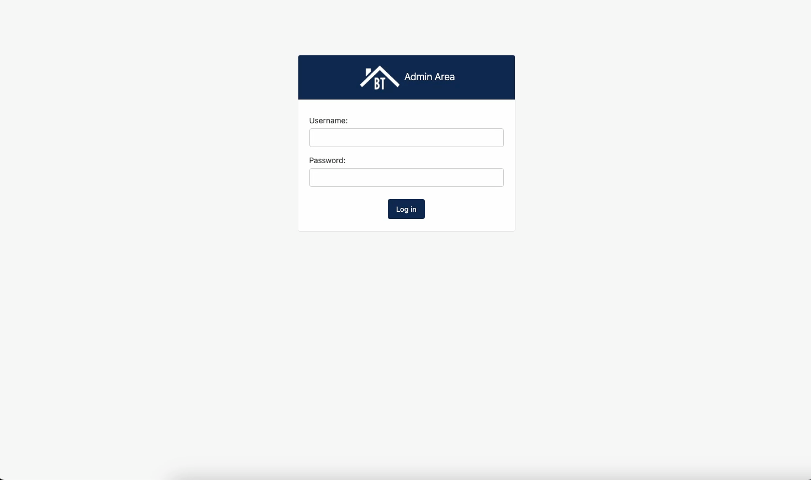

# Real-Estate-Site

## Description
    Full-Stack website built with Django. Users can register, login, view listings, and make inquiries. Admins can add/edit listings, add/edit employees, and see view inquiries.

## Technologies 

- Python
- Django
- JavaScript
- SQL
- PostgreSQL

## Table of Contents
[Description](#description)

[Technologies](#technologies)

[Usage](#usage)

[Credits](#credits)

[Contact](#contact)

## Usage

[View code](https://github.com/JMRobertson89/Real-Estate-Site)

### Home

### About

### Listings

### Single Listing 

### Register

### Inquiry 

### Admin

## Credits

Created alongside [Brad Traversy's Phython Django Dev To Deployment](https://www.traversymedia.com/Python-Django-Dev-To-Deployment)

## Contact

GitHub: [JMRobertson89](https://github.com/JMRobertson89)

Email Joshua Robertson at josh@jrobertson.io